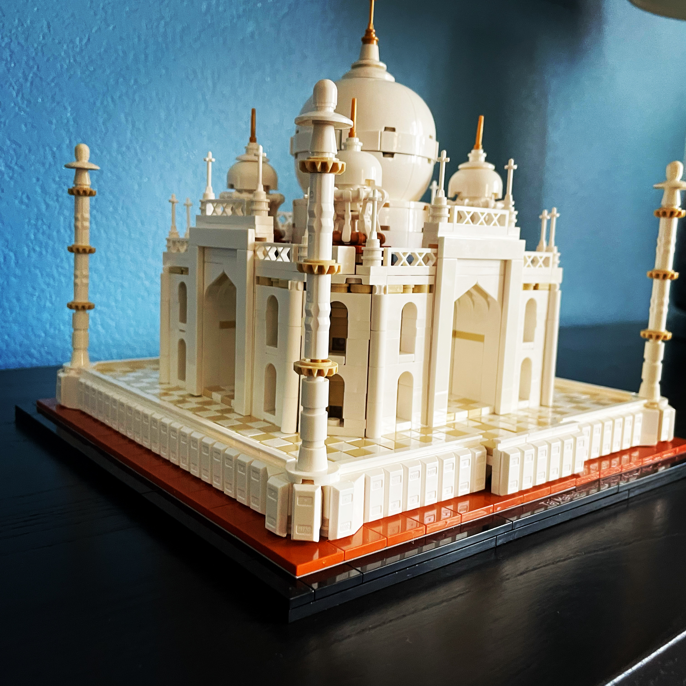

This probably is my first Ghazal.

    दूर आगरा से (door Agra se)
    ==================
    घर से निकले, निकल आये दूर आगरा से,
    रात सोते में सपने आये दूर आगरा से
    Ghar se nikle, nikal aaye door Agra se,
    Raat sote mein, sapne aaye door Agra se
    
    कब जाएँगे, इसका इल्म नहीं है मुझको,
    कैसे रह पायेंगे हमसाये दूर आगरा से
    Kab jayenge, iska ilm nahin hai mujhko,
    Kaise reh payenge, humsaaye door Agra se
    
    तड़प है दिल में, छटपटा रहा हूँ मैं,
    कब तक बेबस, जिया जाए दूर आगरा से
    Tadap hai dil mein, chatapata raha hoon main,
    Kab tak bebas, jiya jaye door Agra se
    
    ‘पलक’ आंसुओं से है भीगी हुई मेरी,
    क्यूँकर गुमसुम यह रह पाये दूर आगरा से
    ‘Palak’ aansuon se hai bheegi hui meri,
    Kyun kar gumsum yeh reh paaye door Agra se
    
    ~पलक (Palak)

