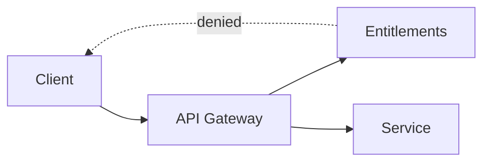
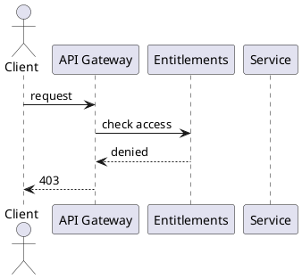
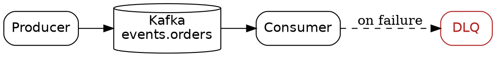

The interesting thing about technology is it's evolution - how one layer quietly becomes the ground the next one stands on. A format gets built for one reason, and years later it turns out to enable something nobody designed it for.

SVG, Mermaid, Graphviz, PlantUML share one property: you write the picture as text and something renders it. That property got adopted because text is easier to diff, patched and version controlled. 

Then generative AI arrived, and the same property paid off a second time. A language model produces text. Therefore, a diagram whose source is text is a diagram a model can write. One technology enabled the next without being asked to.

This post is about the four tools I use, and about that second payoff.

## SVG is source code

An SVG file is XML. You can open it in an editor, read it, change a number, and see the result. That is the whole idea, and it is enough.

It is also why a language model can draw one. Ask for an icon and you get back XML — tags, coordinates, colors — the same kind of token stream the model was trained to produce. Nothing about the request leaves the domain of text. I describe what I want, get a file back, and then work on it directly. Generating the file matters less than being able to edit it afterward, but the generation happens at all only because the format is text. With a raster generator you get a finished grid of pixels and your only options are to regenerate it or paint over it. With SVG you get something you can diff, review, and commit.

I have been asking for output shaped so it is easy to edit:

- Named `id` attributes and `<g>` groups, so I can find the element I want to change without counting paths.
- A round `viewBox`, usually `0 0 100 100`, so coordinates stay readable.
- Colors declared once in a `<style>` block inside the SVG rather than repeated as inline attributes on every element.

That last one saves the most work. A theme change becomes one edit instead of fifty.

Where this works is geometric and structural work: icons, logos, badges, diagrams, anything built from clean primitives with some symmetry. Where it fails is organic form. Faces, animals, illustration. If a request would need a path with fifty control points, it is the wrong tool and no amount of prompting fixes that. This is the edge of the enablement: the model can write the text, but only where the picture is simple enough to be written as text in the first place.

## A logo, start to finish

I recently needed a logo and asset set for an event streaming platform. The whole thing was done as SVG, generated and then edited by hand, with a script to produce the PNG sizes. Generated first because the format let it be, edited second because the format let that too.

The thing to watch is fonts. An SVG that references a font by name renders correctly only where that font is installed. On your machine it looks right. In someone else's browser, or at a printer, it falls back to something else and the layout shifts. For a logo, that is a defect. 

The fix is to convert text to paths. Once converted, the glyph shapes are geometry and render identically everywhere. The cost is that the text is no longer text — you cannot retype it, and it is no longer selectable or searchable.

So I keep two files. First is the editable master with real `<svg>` elements, and a generated flattened copy for distribution. `svgo` cleans up the output, and `resvg` handles the PNG rasterization without needing Inkscape in the pipeline. 


## Mermaid, for diagrams in prose

Hand-writing SVG stops being reasonable once a diagram has more than a handful of nodes. XMLs are tedious and heavy anyway.

Mermaid solves this by letting you describe the graph in a DSL:



It renders in the browser without a toolchain, which is what makes it right for a blog. The diagram lives in the post as text. When the design changes, I edit four lines instead of opening a drawing tool. And because those four lines are so close to how you would describe the graph in words, a model writes them without hesitation. Mermaid is often the first thing a model reaches for when you ask for a diagram, precisely because the syntax is nearly a transcript of the sentence.

Sequence diagrams are where Mermaid is clearly the best of the three. Nothing else expresses a request-response exchange as directly.

## PlantUML, for the standard software diagrams

PlantUML is a DSL aimed at the diagrams software teams draw over and over: sequence, class, component, state, use case. You write the diagram in its text syntax and the tool lays it out.



```
plantuml -tsvg flow.puml
```

There is no browser renderer for this the way there is for Mermaid, so on a page you show the source and commit the rendered SVG or PNG beside it. What PlantUML gives you is a syntax that names the concepts directly — `actor`, `participant`, `-->` and that is also why a model writes it fluently. The vocabulary is small and the shapes are named, so there is little to get wrong. Describe a login flow and you get valid PlantUML back on the first try more often than not. A DSL this constrained is nearly the ideal target for generation: fewer degrees of freedom than raw SVG, more structure than a freehand drawing.

## Graphviz, for graphs you generate

Graphviz is older and lower level. You write the graph in the DOT language and it computes the layout.



```
dot -Tsvg pipeline.dot -o pipeline.svg
```

`dot` is the hierarchical layout engine. The distribution ships several others that take the same input file: `neato` and `fdp` do force-directed layout for undirected graphs, `circo` arranges nodes in a ring, `twopi` does radial. Changing the engine changes the picture without changing the source.

Two features do most of the work. `subgraph cluster_name { ... }` draws a labeled box around a group of nodes, which is how you show a service boundary or a trust zone. And `rank=same` pins nodes to the same level, which is how you stop the engine from producing something that is structurally correct but reads badly.

What Graphviz has over Mermaid is that DOT is trivial to emit from a script. If the graph already exists as data — a dependency tree, a topic-to-consumer map, a module graph — you do not draw it. You write twenty lines that print DOT and let the layout engine handle the rest. The diagram is then derived from the system rather than describing it from memory, which means it cannot drift. That same triviality is why a model can produce DOT for a graph you describe in a sentence: the format is regular enough that a script can print it, and anything a script can print, a model can print too.

The output is SVG, so everything from the first section still applies. You can post-process it, restyle it with your own CSS, and check it in.

## How they fit together

The split I have settled on:

- **Mermaid** for diagrams written by hand inside a post. Fast, no toolchain, renders inline.
- **Graphviz** for anything generated from code, and for graphs large enough that layout tuning matters.
- **PlantUML** for the standard software diagrams — sequence, class, component — where its named vocabulary does the work.
- **Hand-edited SVG** for things where the visual result is the point — logos, banners, posters, anything with exact positioning.

What connects them is not the file format but that a diagram can be reviewed, diffed, and rebuilt. That property was worth having on its own; every diagram I have ever seen go stale went stale because fixing it meant finding the person who had the original file.

But the larger point is the one you only see in hindsight. We made diagrams out of text so we could keep them in Git. Having done that, we also — without planning to — made them out of the one material a language model can produce. If diagrams had stayed as pixels, asking a model to draw one would mean asking it to place several hundred thousand color values, and it cannot do that well. Because the source is text, the model just writes the source, and the renderer that was already there turns it into a picture. The tool built for version control became the tool that let the machine draw. That is usually how it goes: the next capability gets built out of the last one's byproducts.
