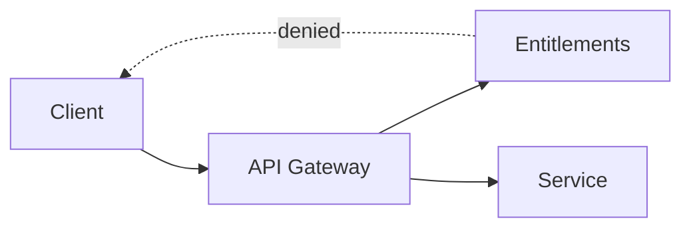
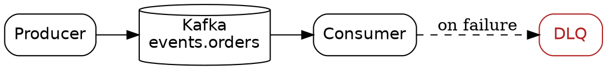

For most of my career, images were the part of my work I could not version. Code went into Git, documents went into Git, and diagrams went into a PNG that someone exported from a drawing tool once and never touched again. When the architecture changed, the diagram did not. Nobody could fix it, because nobody had the file it came from.

Three tools have changed that for me over the past several months: hand-edited SVG, Mermaid, and Graphviz. All three produce vector output from text. That single property — the source is text — is what makes them worth writing about.

## SVG is source code

An SVG file is XML. You can open it in an editor, read it, change a number, and see the result. That is the whole idea, and it is enough.

What made this practical recently is that language models write SVG well. I describe what I want, get a file back, and then work on it directly. Generating the file matters less than being able to edit it afterward. With a raster generator you get a finished artifact and your only options are to regenerate it or paint over it. With SVG you get something you can diff, review, and commit.

I have been asking for output shaped so it is easy to edit:

- Named `id` attributes and `<g>` groups, so I can find the element I want to change without counting paths.
- A round `viewBox`, usually `0 0 100 100`, so coordinates stay readable.
- Colors declared once in a `<style>` block inside the SVG rather than repeated as inline attributes on every element.

That last one saves the most work. A theme change becomes one edit instead of fifty.

Where this works is geometric and structural work: icons, logos, badges, diagrams, anything built from clean primitives with some symmetry. Where it fails is organic form. Faces, animals, illustration. If a request would need a path with fifty control points, it is the wrong tool and no amount of prompting fixes that.

## A logo, start to finish

I recently needed a logo and asset set for an event streaming platform. The whole thing was done as SVG, generated and then edited by hand, with a script to produce the PNG sizes.

The thing to watch is fonts. An SVG that references a font by name renders correctly only where that font is installed. On your machine it looks right. In someone else's browser, or at a printer, it falls back to something else and the layout shifts. For a logo, that is a defect.

The fix is to convert text to paths. Once converted, the glyph shapes are geometry and render identically everywhere. The cost is that the text is no longer text — you cannot retype it, and it is no longer selectable or searchable.

So I keep two files. An editable master with real `<text>` elements, and a flattened copy for distribution. The flattening is a build step, not a manual one. `svgo` cleans up the output, and `resvg` handles the PNG rasterization without needing Inkscape in the pipeline.

This is the same shape as a source tree and a build artifact.

## Mermaid, for diagrams in prose

Hand-writing SVG stops being reasonable once a diagram has more than a handful of nodes. The hard part is no longer drawing the boxes, it is deciding where they go. Layout is the work.

Mermaid solves this for the common cases. You describe the graph and it places everything:



It renders in the browser without a toolchain, which is what makes it right for a blog. The diagram lives in the post as text. When the design changes, I edit four lines instead of opening a drawing tool.

Sequence diagrams are where Mermaid is clearly the best of the three. Nothing else expresses a request-response exchange as directly.

## Graphviz, for graphs you generate

Graphviz is older and lower level. You write the graph in the DOT language and it computes the layout.



```
dot -Tsvg pipeline.dot -o pipeline.svg
```

`dot` is the hierarchical layout engine. The distribution ships several others that take the same input file: `neato` and `fdp` do force-directed layout for undirected graphs, `circo` arranges nodes in a ring, `twopi` does radial. Changing the engine changes the picture without changing the source.

Two features do most of the work. `subgraph cluster_name { ... }` draws a labeled box around a group of nodes, which is how you show a service boundary or a trust zone. And `rank=same` pins nodes to the same level, which is how you stop the engine from producing something that is structurally correct but reads badly.

What Graphviz has over Mermaid is that DOT is trivial to emit from a script. If the graph already exists as data — a dependency tree, a topic-to-consumer map, a module graph — you do not draw it. You write twenty lines that print DOT and let the layout engine handle the rest. The diagram is then derived from the system rather than describing it from memory, which means it cannot drift.

The output is SVG, so everything from the first section still applies. You can post-process it, restyle it with your own CSS, and check it in.

## How they fit together

The split I have settled on:

- **Mermaid** for diagrams written by hand inside a post. Fast, no toolchain, renders inline.
- **Graphviz** for anything generated from code, and for graphs large enough that layout tuning matters.
- **Hand-edited SVG** for things where the visual result is the point — logos, banners, posters, anything with exact positioning.

What connects them is not the file format but that a diagram can be reviewed, diffed, and rebuilt. A picture you can regenerate from text is a picture you can keep accurate. Every diagram I have ever seen go stale went stale because fixing it meant finding the person who had the original file.
