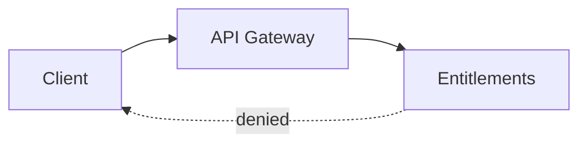

I recently needed a banner for my LinkedIn profile. I described what I wanted to a language model and got back an SVG, which is an XML file of tags, coordinates, and colors. I opened it in a text editor, adjusted what I did not like, and ran a script to produce the PNG sizes. At no point did I open a drawing tool.

There are models that can paint a picture. Image generators such as Nano Banana return finished pixels. But a finished picture can only be accepted, rejected, or regenerated. A language model produces text, and an SVG stores a picture as text. The model drew the banner by writing out the file. What I got back was not a fixed image but source I could edit.

SVG is not unusual in this. Mermaid describes flowcharts in a few lines of a small language. Graphviz does the same for graphs with DOT. PlantUML covers the standard software diagrams like sequence, class, and component. Each of these formats has an interesting story behind it. SVG is XML because it was designed as a web standard, and browsers render markup. DOT is text because Graphviz was built to lay out graphs that programs generate. Mermaid and PlantUML are text so that a diagram can live next to the prose and code it describes. There is one more interesting thing about all of them using text to describe a diagram. A diagram that is text can be diffed, reviewed, and committed like any other source file.

None of these formats was designed with a language model in mind. Yet they are exactly what a language model needs. Here is a flowchart, written as text:

```
flowchart LR
  client[Client] --> gw[API Gateway]
  gw --> ent[Entitlements]
  ent -.denied.-> client
```

The renderer this blog already uses turns those four lines into a picture:



When the design changes, I just need to edit four lines instead of redrawing anything. A model can write those four lines as easily as I can, because they sit close to how the picture would be described in words. The same holds for DOT and PlantUML: small vocabularies, named shapes, little room to go wrong.

There is a limit, and it is the same property seen from the other side. Writing a picture as text works only where the picture is simple enough to be written as text. Icons, badges, flowcharts, architecture diagrams — things built from clean primitives — sit comfortably inside it. A face or an animal does not. The model can still emit a path with fifty control points, but at that point the source is no longer something a person can read or fix, and the reason for wanting text is gone.

If diagrams had stayed pixels, drawing one would belong to the image models, and the result would be a flat picture with nothing to diff and nothing to edit. Because these formats store the picture as text, the model writes the source, and the renderers that were already there turn it into a picture. The formats were built for browsers, for graph layout, for documentation. Nobody planned the second use.
